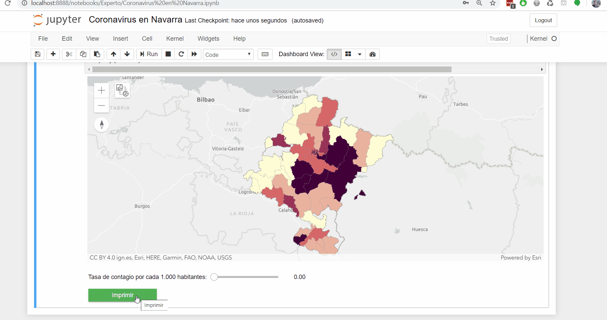

# CovidNavarra
Jupyter Notebook con un análisis interactivo de la tasa de casos por COVID19 en Navarra

Require:
  - ArcGIS Python API: https://developers.arcgis.com/python/
  - ArcPy: https://pro.arcgis.com/es/pro-app/arcpy/get-started/what-is-arcpy-.htm
  - Jupyter Dashboards: https://jupyter-dashboards-layout.readthedocs.io/en/latest/
  
 
 
